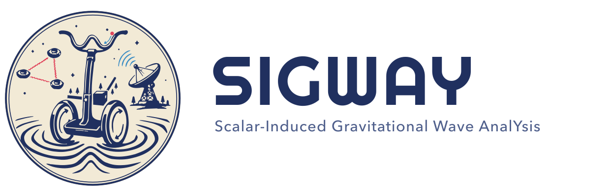

<p align="center">
  <picture>
    <source media="(prefers-color-scheme: dark)" srcset="docs/assets/images/lockup_horizontal_dark.png">
    
  </picture>
</p>

<p align="center">
  <b>Scalar-Induced Gravitational Wave AnalYsis</b> — second-order, scalar-induced gravitational-wave signals.
</p>

<p align="center">
  <a href="https://sigway.readthedocs.io">Documentation</a> ·
  <a href="https://arxiv.org/abs/2501.11320">Paper</a> ·
  <a href="https://pypi.org/project/sigway/">PyPI</a>
</p>

SIGWAY is a collaborative effort of the LISA Cosmology Working Group to build the foundation of a data analysis pipeline for stochastic gravitational wave signals emitted by curvature perturbations in the early universe. Currently the package contains modules for

- solving the Mukhanov-Sasaki equation for single field ultra-slow roll inflationary models and computing the primordial scalar power spectrum $\mathcal{P}_\zeta$;
- computing the second order gravitational wave power spectrum $\Omega_{\mathrm{GW}}$ from $\mathcal{P}_\zeta$ for reentry during radiation domination or a phase of early matter domination.

Full documentation — installation, worked examples, the physics, and the API reference — is at **[sigway.readthedocs.io](https://sigway.readthedocs.io)**.

### Using this code
If you use this code please cite our paper (https://arxiv.org/pdf/2501.11320) and feel free to drop me an email if you encounter any problems. Also, if there are bugs please report them!

### Installation

SIGWAY is on PyPI:

```bash
pip install sigway
```

To work on the code, install the development version from a clone in editable mode:

```bash
git clone https://github.com/jonaselgammal/SIGWAY.git
cd SIGWAY
pip install -e .
```

### Usage

$\Omega_{\mathrm{GW}}(f)$ is computed by composing three pieces — a **power
spectrum** $\mathcal{P}_\zeta$ (`sigway.perturbations`), a **kernel** (the
transfer function, `sigway.kernels`) and an **integrator** (the numerical
method, `sigway.integrators`, default Simpson) — into an `OmegaGW` model
(`sigway.spectrum`):

```python
import jax.numpy as jnp
from sigway.spectrum import OmegaGW
from sigway.kernels import RadiationKernel
from sigway.perturbations import AnalyticPerturbations

def pzeta(k, logA, logks):                 # your P_zeta(k, *params)
    A, ks = 10.0 ** logA, 10.0 ** logks
    return A * jnp.exp(-0.5 * (jnp.log(k / ks) / 0.3) ** 2)

f = jnp.geomspace(1e-5, 1e-1, 200)
model = OmegaGW(
    AnalyticPerturbations(pzeta, ("logA", "logks")),
    RadiationKernel(),                     # carries the RD normalisation
    s=jnp.linspace(0.0, 1.0, 10),
    t=jnp.geomspace(1e-5, 1e3, 800),       # array (shared over k) or t(k, *theta)
)

omega = model(f, -2.0, -2.0)               # theta in model.parameter_names order
```

The model owns a single ordered parameter vector for inference:

```python
model.parameter_names          # ('logA', 'logks')
model(f, logA=-2.0, logks=-2.0)            # keyword form also works
fisher_jac = model.jacobian(f, [-2.0, -2.0])   # d Omega_GW / d theta (jax.jacfwd)
```

Swap in other physics by changing a component:

- **Early matter domination:** `from sigway.kernels import InstantEMDKernel`
  (its source cutoff `kmax` is a `ScalarPerturbations` parameter).
- **Mukhanov–Sasaki** $\mathcal{P}_\zeta$: wrap a
  `sigway.ms_solver.SingleFieldSolver` in
  `sigway.perturbations.SingleFieldPerturbations`.

> The previous `OmegaGWjax` / `OmegaGWms` classes are **deprecated** (they emit a
> `DeprecationWarning`); use `OmegaGW` with a kernel and a perturbation instead.

### Dependencies

The current, minimal public version that contains the core functionality of the package needs jax, diffrax, numpy, scipy and matplotlib. The dependencies should be installed automatically but if not pip is your friend.
