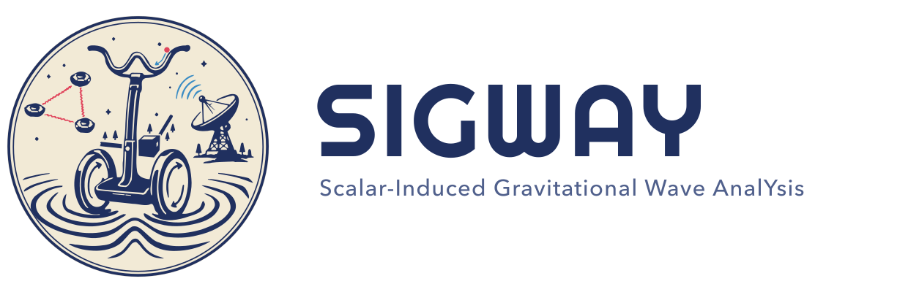

# SIGWAY

{ .sigway-hero }

**S**calar-**I**nduced **G**ravitational **W**ave **A**nal**Y**sis.

> TODO (agent): one-paragraph pitch — what SIGWAY computes, who it's for, and the
> one thing that makes it nice to use. Link to Getting started and Theory.
