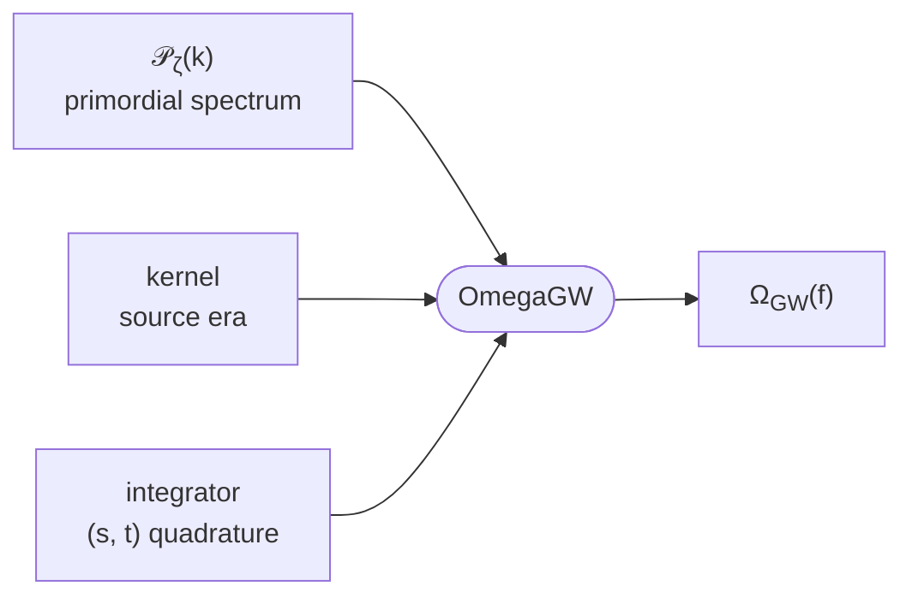

# SIGWAY

{ .sigway-hero }
{ .sigway-hero }

**SIGWAY** (**S**calar-**I**nduced **G**ravitational **W**ave **A**nal**Y**sis) computes the
stochastic gravitational-wave background induced **at second order** by primordial
curvature perturbations — *scalar-induced gravitational waves* (SIGWs). It is under
active development by the LISA Cosmology Working Group; if you use it, please cite
[arXiv:2501.11320](https://arxiv.org/abs/2501.11320).

You build a spectrum from three interchangeable pieces, composed into one model:

The whole pipeline is written in [JAX](https://jax.readthedocs.io): every model is
`jit`-compiled and **differentiable**, so a Fisher forecast is one `.jacobian` call away.

## What it can do

- **Analytic power spectra.** Hand `AnalyticPerturbations` any closed-form
  $\mathcal{P}_\zeta(k)$ — a log-normal peak, broken power law, flat-with-cutoff,
  oscillatory multifield template, … — and get $\Omega_{\mathrm{GW}}(f)$. Cheap and
  fully differentiable.
- **Inflation from first principles.** `SingleFieldPerturbations` is a
  Mukhanov–Sasaki solver: give it an inflaton potential $V(\phi)$ and it
  integrates the background **and** the mode equations to produce
  $\mathcal{P}_\zeta$ — e.g. ultra-slow-roll quasi-inflection-point models.
- **Binned / model-independent reconstruction.** `Binned_P_zeta` represents
  $\mathcal{P}_\zeta$ as free amplitudes in $k$-bins — a template-free way to fit or
  forecast the spectrum, exposing the same `parameter_names` / `jacobian` interface as
  everything else.
- **Different cosmological eras.** Switch the source era by swapping the kernel:
  `RadiationKernel` (radiation domination) or `InstantEMDKernel` (an early
  matter-dominated era ending in a sudden transition to radiation).
- **Built for inference.** Models are `jit`-compiled and differentiable: one ordered
  parameter vector plus a `.jacobian` (forward-mode autodiff, with finite differences
  for non-smooth knobs such as a source cutoff) gives Fisher forecasts directly.
- **Composable & extensible.** `OmegaGW` simply composes a *perturbations* object, a
  *kernel* and an *integrator* — each a small base class you can subclass to add new
  physics or a new quadrature.

## Where to start

- **[Installation](getting-started/installation.md)** — get it running.
- **[Simple example](examples/simple_example.ipynb)** — the minimum to get a spectrum.
- **[Advanced example](examples/advanced_example.ipynb)** — a tour of the components.
- **[Theory & modelling](theory/index.md)** — the physics, and which knob means what.
